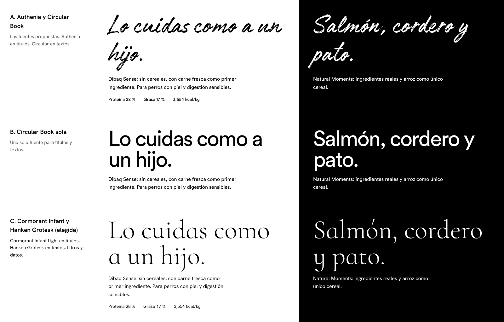

# Dibaq Perú: web informativa

Web de una sola página para **Dibaq Natural Moments** y **Dibaq Sense**, alimento holístico para perros y gatos. Es informativa: muestra los productos y ayuda a elegir, pero no vende ni tiene carrito.

## Cómo verla

La página usa módulos de JavaScript y fuentes propias, así que necesita un servidor local (abrir `index.html` con doble clic no carga la escena 3D):

```bash
cd dibaq-pe
python3 -m http.server 8000      # o: npx serve .
```

Luego abre `http://localhost:8000`. Para publicarla basta con subir la carpeta completa a cualquier hosting estático (o a WordPress como página aparte). No requiere compilación.

## Concepto

- **Blanco y negro en toda la interfaz. El único color es el alimento.** Solo tienen color las croquetas 3D, las proteínas (cada una con su tono: salmón, cordero, pavo…) y las bolsas.
- **Natural Moments vive en blanco y Sense en negro.** En "Las dos líneas" la pantalla se parte en dos mitades. En el buscador, las tarjetas blancas y negras se intercalan, así las dos líneas conviven en la misma grilla.
- **Una croqueta protagonista.** Una escena 3D en tiempo real acompaña el recorrido. En el inicio, una nube de croquetas gira alrededor de la principal. En "Holístico" forman un anillo en órbita, y la croqueta se gira hacia el pilar que señala el visitante. En "Las dos líneas" caen sobre la frontera entre blanco y negro. En "Perro o gato" la croqueta cambia de forma: anillo para perro, triángulo para gato.
- **Mensajes para quien lo cuida como a un hijo:** "Lo cuidas como a un hijo. Aliméntalo igual." Los textos son concretos (porcentajes, ingredientes, lo que no contiene) porque este público lee la etiqueta.

## Tipografía: evaluación de las fuentes propuestas



| Fuente | Evaluación |
|---|---|
| **Authenia** (Mika Melvas) | Es una caligrafía de pincel seco, enérgica y manual. Se asocia más a lo artesanal, lo urbano o lo deportivo que a la calma y la precisión que busca un dueño exigente. En títulos largos cuesta leerla y no tiene otros pesos. **No la recomiendo para Dibaq.** |
| **Circular Book** (Lineto) | Es muy legible y funciona bien en interfaz, pero tiene un tono tecnológico (es la letra de marcas digitales muy conocidas) y solo se entregó un peso. Además, ya es la tipografía de CooKing. Si las dos marcas se venden en las mismas tiendas, compartir letra las confunde. Su licencia web es comercial. **Buena, pero no para esta marca.** |
| **Cormorant Infant + Hanken Grotesk** (elegida) | Cormorant Infant es un serif clásico, de trazo fino, elegante y orgánico. Su variante "Infant" usa la *a* y la *g* de un solo piso, las de los libros para niños: suaviza el tono y conecta con "como a un hijo". Hanken Grotesk es una sans precisa para textos, filtros y datos nutricionales, y da el tono de rigor. Ambas tienen licencia libre (SIL Open Font License), así que se pueden usar en web, impresos y redes sin costo. |

Las fuentes están en `fonts/` en WOFF2 (solo el juego latino, unos 120 KB en total), con sus licencias.

## Secciones

1. **Inicio:** título, entrada animada (el único momento orquestado de la página) y la nube de croquetas.
2. **Holístico es mirarlo entero:** digestión, piel y pelo, articulaciones, peso y energía. Cada pilar enlaza al buscador ya filtrado.
3. **Las dos líneas:** Natural Moments en blanco y Sense en negro. En computadora, la mitad que señala el visitante se ensancha. En celular, se cambia con las pestañas o deslizando de lado.
4. **Un gato no es un perro pequeño:** conmutador Perro / Gato, conteo de recetas y rango de proteína calculado del catálogo.
5. **Lo que lleva. Lo que no:** once proteínas como palabras grandes, con el número de recetas en que aparece cada una. Al tocar una, toma su color y ofrece "Ver las recetas con…" y "Ver las recetas sin…".
6. **Encuentra su alimento:** el buscador (detalle abajo).
7. **Desde Segovia, con oficio:** origen, trayectoria y la ruta Fuentepelayo–Lima.
8. **Contacto:** formulario de consulta y pie de página.

### Una sección por gesto

- En computadora, cada giro de la rueda o gesto del touchpad lleva exactamente a la sección siguiente o anterior. La inercia del mismo gesto no salta dos secciones. Las listas con scroll propio (resultados, filtros, ficha) se recorren primero.
- En celulares y tablets, cada deslizamiento lleva a la sección siguiente (`scroll-snap` con `scroll-snap-stop: always`).
- Teclado, barra de desplazamiento, menú y riel lateral también caen al inicio de cada sección.
- Cada sección mide exactamente una pantalla. Probado en 1920×1080, 1440×900, 1366×657, 1280×720, 1024×768, 768×1024, 412×915, 390×844, 375×667 y 360×640.

### Buscador

- **Para:** perro, gato o ambos.
- **Edad:** cachorro o gatito, adulto, senior.
- **Raza y peso** (solo perro): al escribir la raza se completa el peso típico (40 razas, incluido el perro sin pelo del Perú). El deslizador de peso define el tamaño: pequeño hasta 10 kg, mediano de 11 a 25 kg, grande desde 26 kg.
- **Necesita:** alergias o piel sensible, digestión delicada, control de peso, articulaciones, pelo y piel brillantes. Para gatos, además, esterilizado y salud urinaria.
- **No puede comer:** salmón, pescado, pavo, pollo, cordero, pato, cereales. "Pescado" también excluye el krill y los aceites de pescado (por ejemplo, el aceite de salmón del Sense Cordero).
- **Línea:** las dos, Natural Moments o Sense.
- Un resumen en lenguaje natural dice qué se está viendo ("9 recetas para tu perro adulto de 6 kg, sin pollo."). Si ningún producto cumple, el buscador sugiere qué filtro quitar y cuántas recetas aparecerían.
- Los filtros quedan en la dirección (`?especie=perro&edad=adulto&sin=pollo`) y cada ficha también (`?producto=sense-perro-cordero`), así se pueden compartir por WhatsApp.
- La **ficha** de cada producto muestra la bolsa, para quién es, ingredientes principales con porcentaje, lo que no contiene, análisis garantizado, energía y formatos. Tiene botones para pasar a la receta anterior o siguiente y un botón de consulta (WhatsApp si está configurado; si no, lleva al formulario con el mensaje listo).

## Cómo editar

| Qué | Dónde |
|---|---|
| Productos, ingredientes, análisis, formatos | `js/catalogo.js` (un arreglo comentado; los conteos de toda la página salen de ahí) |
| WhatsApp, correo, redes, distribuidor, tiendas, fotos | `window.DIBAQ_CONFIG` al inicio de `index.html` |
| Fotos de ambiente | `img/fotos/` (ver `img/fotos/LEEME.md`) |
| Fotos de las bolsas | `img/productos/<id>.webp`, con el mismo nombre que el `id` del producto |
| Colores, tamaños y espacios | `css/estilos.css` (variables al inicio) |
| Escena 3D | `js/escena.js` |

### Bolsas de producto

Las bolsas de `img/productos/` son **renders 3D provisionales**: bolsa negra para Sense y blanca para Natural Moments, con el color de la proteína abajo. No son los empaques reales. Para usar las fotos reales, reemplaza cada archivo por la foto oficial (fondo transparente, WebP, unos 800 × 1000 px) con el mismo nombre.

Si cambia el catálogo y todavía no hay foto, se puede generar el render de un producto nuevo:

```bash
node herramientas/render-bolsas.mjs nm-perro-nuevo-id   # requiere Playwright con Chromium
```

Sin argumentos regenera todas, así que pásale solo los `id` que no tengan foto real.

## Pendientes antes de publicar

1. **Validar el catálogo con Dibaq.** Los datos vienen de fichas públicas de tiendas en España y Chile porque dibaqpetcare.com no fue accesible desde el entorno de trabajo. Todos los productos tienen `verificar: true`. Puntos a revisar:
   - Qué productos se importan realmente a Perú. Hay que quitar del arreglo los que no se vendan.
   - Análisis que faltan: Sense Cachorro salmón y pavo, Sense Cordero mini, Sense Gatito, Sense Esterilizado, Natural Moments Cachorro razas medianas, Adulto razas medianas, Gatito y Esterilizado.
   - Datos que no coinciden entre fuentes:
     - Sense Urinary: proteína 32 a 34 % y grasa 13 a 15 %.
     - Sense Salmón mini: 26 % de proteína en la ficha española y 28 % en otras.
     - Sense Light y senior: algunas tiendas no mencionan el pollo.
     - Natural Moments Complete Care: la composición cambia según la fuente.
     - Natural Moments Adulto razas medianas: una tienda lista otra receta.
   - Natural Moments **Adulto razas pequeñas** sale de la ficha "Farm & Field Adult Mini". Hay que confirmar su nombre actual en la gama 5 Star.
   - Formatos que faltan: Sense Conejo y Wild; Natural Moments Cachorro razas grandes, Adulto razas pequeñas, Ultralight, Gatito, Complete Care y Esterilizado.
   - Sense Cordero mini: confirmar si lleva aceite de salmón, como la receta estándar. Si lo lleva, hay que sumar `"pescado"` a su `contiene` para que el filtro "Sin pescado" lo excluya.
2. **Confirmar las afirmaciones de marca:**
   - "Hasta 95 % de proteína de origen animal".
   - "Cocinado a baja temperatura".
   - "Más de 40 años" y "65 países".
   - El premio de la gama Sense para gatos en los Pet Innovation Awards 2024.
3. **Fotos reales de las 24 bolsas** (ver arriba) y fotos de ambiente (ver `img/fotos/LEEME.md`).
4. **Logo oficial.** El encabezado usa el nombre "DIBAQ" en texto. Con el SVG oficial se reemplaza en `.marca` de `index.html`.
5. **Contacto:** completar `whatsapp`, `email` (o `formEndpoint`), redes, distribuidor y tiendas en `DIBAQ_CONFIG`. Mientras `email` esté vacío, el formulario avisa que falta configurarlo.
6. **Aprobación de marca de Dibaq España** para el uso de nombres, claims y la línea gráfica en Perú.
7. **No incluido por ahora:** comida húmeda (latas), la línea Sense Low Grain y snacks. El catálogo admite más productos con los mismos campos.

## Notas técnicas

- **Sin dependencias de compilación.** HTML, CSS y JavaScript. three.js r170 viene incluido en `vendor/` (licencia MIT) y carga solo para la escena 3D.
- **Croquetas generadas por código:** no hay modelos 3D externos. La textura de poros también se dibuja al cargar. Si el equipo no da abasto, la escena baja la resolución sola. Deja de dibujarse fuera de las secciones donde aparece y cuando la pestaña no está visible.
- **Sin WebGL**, o si la escena no arranca, el inicio muestra una imagen fija de las croquetas (`img/croquetas.webp`).
- **Movimiento reducido:** si el sistema lo pide, la entrada del título no se anima y las croquetas quedan quietas.
- **Accesibilidad:**
  - Enlace para saltar al contenido y foco visible en todo el recorrido.
  - Pestañas y conmutadores con roles ARIA.
  - La ficha es un diálogo que atrapa el foco, se cierra con Esc y devuelve el foco a la tarjeta.
  - El resumen de resultados se anuncia a lectores de pantalla.
  - Los textos cumplen contraste AA.
- **SEO:** título, descripción y Open Graph en español de Perú, con un `h1` real.

## Fuentes de datos

Fichas públicas consultadas para el catálogo (octubre de 2026):

- [Dibaq Sense en Kiwoko](https://www.kiwoko.com/perros/especial-cachorro/pienso-para-cachorros/dibaq-sense-grain-free-salmon-y-pavo-pienso-para-cachorros/DIB1005977_M.html)
- [Tiendanimal: Sense Salmón](https://www.tiendanimal.es/dibaq-sense-grain-free-adult-salmon-pienso-para-perros/DIB1005981_M.html)
- [Kiwoko: Sense Cordero](https://www.kiwoko.com/perros/comida-para-perros/pienso-seco-para-perros/pienso-sin-cereales/dibaq-sense-grain-free-adult-cordero-pienso-para-perros/DIB1005985_M.html)
- [Piensos Raposo: Sense Conejo](https://www.piensosraposo.es/es/Dibaq-Sense/2805-dibaq-sense-perro-adult-sensitive-digestion-grain-free-conejo.html)
- [Masquepiensos: Sense Wild](https://masquepiensos.com/tienda/perros/perros-pienso-para-perros/dibaq/dibaq-sense-grain-free-wild/)
- [Bruno&Henry: Sense Light y senior](https://brunoandhenry.com/product/pienso-dibaq-sense-grain-free-lightsenior-pato-y-pavo/)
- [Mascotaplanet: Sense Salmón mini](https://www.mascotaplanet.com/en/comprar-dibaq-sense-holistic-salmon-mini.html)
- [Petzone: Sense Cordero mini](https://petzone.com/ksa/en/shop/dog/dog-food/dry-food/dibaq-sense-grain-free-lamb-adult-mini-dog-dry-food-6-kg.html)
- [Kiwoko: Sense Urinary gato](https://www.kiwoko.com/gatos/comida-para-gatos/pienso-seco-para-gatos/sin-cereales/dibaq-sense-urinary-grain-free-adult-salmon-y-atun-pienso-para-gatos/DIB1010272_M.html)
- [Masquepiensos: Sense Sterilized gato](https://masquepiensos.com/tienda/gatos/gatos-pienso-para-gatos/dibaq-gato/dibaq-sense-cat-grain-free-sterilized/)
- [Felinus: Sense Kitten](https://felinus.cl/dibaq-sense/dibaq-sense-kitten-salmon-y-pavo.html)
- [Planeta Huerto: Natural Moments 5 Star](https://www.planetahuerto.es/products/dibaq-natural-moments-5-star-pavo-y-pollo-cachorro-razas-medianas-12-kg)
- [Mascotaplanet: Natural Moments Ocean](https://www.mascotaplanet.com/comprar-dibaq-natural-moments-ocean-salmon-para-perros.html)
- [Mascotas1000: Mobility, Ultralight, Complete Care](https://mascotas1000.com/products/dibaq-natural-moments-dog-mobility)
- [Masquepiensos: Natural Moments Ocean Sterilized gato](https://masquepiensos.com/tienda/gatos/gatos-pienso-para-gatos/dibaq-gato/dibaq-natural-moments-cat-ocean-sterilized/)
- [Masquepiensos: Natural Moments Adulto mini](https://masquepiensos.com/tienda/perros/perros-pienso-para-perros/dibaq/dibaq-natural-moments-adulto-mini/)
- [Interempresas: Iberzoo Propet 2025 (trayectoria y países)](https://www.interempresas.net/Puericultura/590488-Los-expositores-de-Iberzoo-Propet-presentan-sus-novedades-(Parte-1).html)
- [Alimarket: Dibaq Petcare diversifica](https://www.alimarket.es/alimentacion/noticia/423184/dibaq-petcare-diversifica-con-mas-innovacion-y-aborda-el-canal-veterinario)
