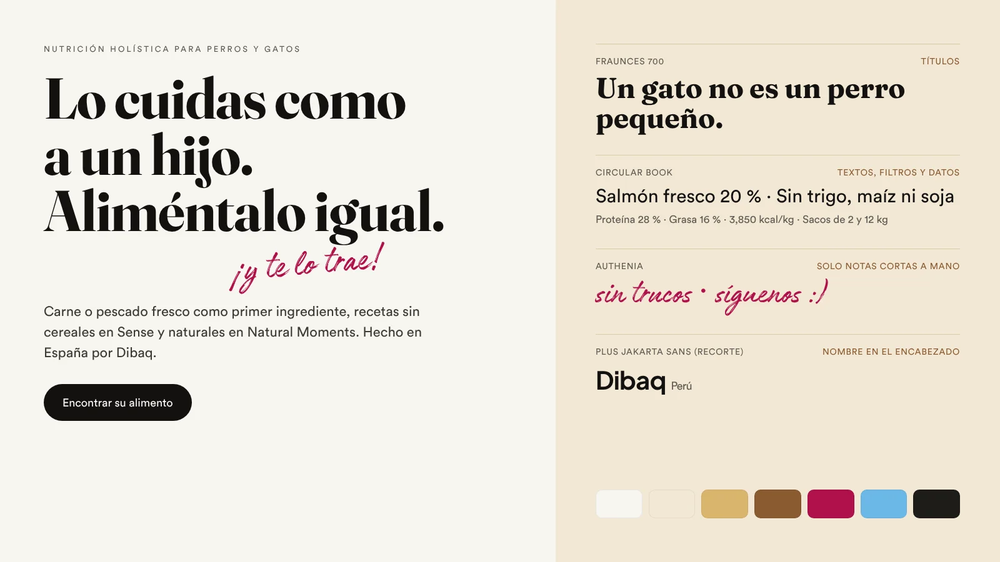

# Dibaq Perú: web informativa

Web de una sola página para **Dibaq Sense** y **Dibaq Natural Moments**, alimento holístico para perros y gatos. Es informativa: muestra los productos y ayuda a elegir, pero no vende ni tiene carrito.

## Cómo verla

La página usa módulos de JavaScript y fuentes propias, así que necesita un servidor local (abrir `index.html` con doble clic no carga las animaciones 3D):

```bash
cd dibaq-pe
python3 -m http.server 8000      # o: npx serve .
```

Luego abre `http://localhost:8000`. Para publicarla basta con subir la carpeta completa a cualquier hosting estático (o a WordPress como página aparte). No requiere compilación.

### Versión de un solo archivo

`dist/dibaq-peru.html` trae todo adentro: fuentes, estilos, imágenes, bolsas, catálogo y las animaciones. Se abre con doble clic, sin servidor ni internet, y sirve para enviarla por correo o WhatsApp a quien tenga que revisarla.

Es una copia generada: los cambios se hacen en la carpeta y luego se regenera con

```bash
npm i -D esbuild                   # una sola vez
node herramientas/empaquetar.mjs
```

## Concepto (versión 2)

La primera versión era en blanco y negro con croquetas 3D en forma de anillo. Se descartó: el blanco y negro cansaba y el alimento holístico de Dibaq nunca tiene esa forma. Esta versión toma la identidad de los propios empaques y redes de Dibaq.

- **Una paleta cálida, sacada del empaque y de las redes.** El fondo es papel (`#F7F5F0`) y crema (`#F2E8D5`); el texto es casi negro, pero los bloques negros se reservan para lo que es negro en la realidad: el bosque de las bolsas Natural Moments y el pie de página. El acento es el pasto dorado y el roble de las fotos, más un magenta para las notas escritas a mano (como en las publicaciones de Dibaq). Cada receta trae además su color de etiqueta (celeste para salmón, granate para cordero…).
- **El perro que te trae su comida.** En el inicio, el bulldog de la foto entregada llega al trote desde el fondo de un parque a contraluz, con su bolsa Sense en el hocico, y se sienta junto al título: "Lo cuidas como a un hijo. Aliméntalo igual. ¡Y te lo trae!". Es la foto real animada (respira, ladea la cabeza, la bolsa se balancea) sobre un parque pintado por código, no un dibujo.
- **La S de ingredientes, en 3D.** Como en el frente de cada bolsa Sense: salmón, pavo, hojas de espinaca, zanahoria, camote, arándanos, manzana y romero se arman en una S cuando la sección entra en pantalla y se desarman al salir. Nada de croquetas con forma de dona.
- **Las dos líneas, cada una con su mundo.** Sense en blanco, con el dato de carne y el sello Grain Free. Natural Moments con su bosque entre la niebla y el sello Five Star Menu.
- **Mensajes para quien lo cuida como a un hijo.** Los textos son concretos (porcentajes, ingredientes, lo que no contiene) porque este público lee la etiqueta.

Referencias de estructura: Taste of the Wild (paisaje detrás del producto, filtros con conteo) y Nutram Perú (consulta por WhatsApp y dónde comprar por distrito).

## Tipografía



En la primera versión se descartaron Authenia y Circular. Al estudiar mejor la marca, la decisión cambia: las dos encajan con lo que Dibaq ya usa.

| Fuente | Uso | Por qué |
|---|---|---|
| **Fraunces** (serif, SIL OFL) | Títulos | Es la más cercana al serif grueso y suave de la palabra "Sense" en el empaque. Da el tono cálido y premium. |
| **Circular Book** (Lineto, la entregada) | Textos, filtros, datos, botones | El logotipo de Dibaq es una sans geométrica; Circular conversa con él y es muy legible en datos nutricionales y en celular. |
| **Authenia** (Mika Melvas, la entregada) | Solo notas cortas escritas a mano: "¡y te lo trae!", "sin trucos", "síguenos :)" | Las publicaciones de Dibaq combinan mayúsculas con una frase en pincel. Authenia cumple ese papel. En textos largos cuesta leerla, así que nunca se usa para más de cuatro palabras ni para información. |
| **Plus Jakarta Sans** (SIL OFL) | Solo el nombre "Dibaq" del encabezado, hasta tener el SVG oficial | Recorte de 3 KB con las letras del logo. |

**Licencias:** Circular y Authenia son fuentes comerciales. Antes de publicar hay que confirmar que Dibaq (o la agencia) tiene licencia **web** de ambas; los archivos de `fonts/` son los que se entregaron. Circular también es la letra de CooKing: si las dos marcas comparten tiendas, conviene que el resto del sistema (Fraunces, colores, fotos) las distinga, como aquí.

Las fuentes están en `fonts/` en WOFF2. Authenia va recortada a los caracteres del español (264 KB).

## Secciones

1. **Inicio:** el perro que trae la bolsa, el título y el acceso directo al buscador.
2. **Las dos líneas:** Sense y Natural Moments lado a lado en computadora; en celular, con pestañas.
3. **Lo que lleva:** la S de ingredientes en 3D y las proteínas, cada una con el número de recetas en que aparece. Al tocar una, ofrece "Ver las recetas con…" y "Ver las recetas sin…".
4. **Holístico es mirarlo entero:** digestión, piel y pelo, articulaciones, peso y energía. Cada pilar enlaza al buscador ya filtrado.
5. **Un gato no es un perro pequeño:** conmutador Perro / Gato, conteo de recetas y rango de proteína calculado del catálogo.
6. **Encuentra su alimento:** el buscador (detalle abajo).
7. **Tips, consejos y muchos peludines:** publicaciones de redes.
8. **¿Dónde lo encuentro?:** tiendas por distrito, WhatsApp, redes y formulario de consulta.

### Una sección por gesto

- En computadora, cada giro de la rueda o gesto del touchpad lleva exactamente a la sección siguiente o anterior. La inercia del mismo gesto no salta dos secciones. Las listas con scroll propio (resultados, filtros, ficha) se recorren primero.
- En celulares y tablets, cada deslizamiento lleva a la sección siguiente (`scroll-snap` con `scroll-snap-stop: always`).
- Teclado, barra de desplazamiento, menú y riel lateral también caen al inicio de cada sección.
- Cada sección mide una pantalla. Probado en 1920×1080, 1440×900, 1280×680, 1024×768, 820×1180, 412×915, 390×844, 375×667 y 360×740.

### Buscador

- **Para:** perro, gato o ambos.
- **Edad:** cachorro o gatito, adulto, senior.
- **Raza y peso** (solo perro): al escribir la raza se completa el peso típico (40 razas, incluido el perro sin pelo del Perú). El deslizador de peso define el tamaño: pequeño hasta 10 kg, mediano de 11 a 25 kg, grande desde 26 kg.
- **Necesita:** alergias o piel sensible, digestión delicada, control de peso, articulaciones, pelo y piel brillantes. Para gatos, además, esterilizado y salud urinaria.
- **No puede comer:** salmón, pescado, pavo, pollo, cordero, pato, cereales. "Pescado" también excluye el krill y los aceites de pescado (por ejemplo, el aceite de salmón del Sense Cordero).
- **Línea:** las dos, Sense o Natural Moments.
- Cada opción muestra cuántas recetas quedarían al elegirla, como en Taste of the Wild. Las que dejarían cero se atenúan.
- Un resumen en lenguaje natural dice qué se está viendo ("9 recetas para tu perro adulto de 6 kg, sin pollo."). Si ningún producto cumple, el buscador sugiere qué filtro quitar y cuántas recetas aparecerían.
- Los filtros quedan en la dirección (`?especie=perro&edad=adulto&sin=pollo`) y cada ficha también (`?producto=sense-perro-cordero`), así se pueden compartir por WhatsApp.
- La **ficha** de cada producto muestra la bolsa, para quién es, ingredientes principales con porcentaje, lo que no contiene, análisis garantizado, energía y formatos. Tiene botones para pasar a la receta anterior o siguiente y un botón de consulta (WhatsApp si está configurado; si no, lleva al formulario con el mensaje listo).

## Cómo editar

| Qué | Dónde |
|---|---|
| Productos, ingredientes, análisis, formatos, color de cada receta | `js/catalogo.js` (un arreglo comentado; los conteos de toda la página salen de ahí) |
| WhatsApp, correo, redes, distribuidor, tiendas, publicaciones | `window.DIBAQ_CONFIG` al inicio de `index.html` |
| Publicaciones de "Peludines" | `img/comunidad/` (864 × 1080, WebP) y la lista `publicaciones` de `DIBAQ_CONFIG` |
| Fotos de marca (perro con la bolsa, gato, cachorro) | `img/marca/` |
| Fotos de las bolsas | `img/productos/<id>.webp`, con el mismo nombre que el `id` del producto |
| Colores, tamaños y espacios | `css/estilos.css` (variables al inicio) |
| Animación del inicio | `js/entrega.js` (movimiento y revelado) y `js/entrega-pintura.js` (parque, pasto y sombra) |
| S de ingredientes | `js/ingredientes3d.js` |

Cuando `whatsapp` tiene un número, aparecen el botón flotante, el botón "Asesoría" del encabezado y el canal en "¿Dónde lo encuentro?". Con `tiendas` cargadas, se puede filtrar por distrito.

### Bolsas de producto

Las bolsas de `img/productos/` son **renders provisionales** que siguen el diseño real de cada línea: Sense blanca con la S de ingredientes y el sello Grain Free; Natural Moments con el bosque entre la niebla, el sello Five Star Menu y la etiqueta de color de cada receta. No son los empaques reales. Para usar las fotos reales, reemplaza cada archivo por la foto oficial (fondo transparente, WebP, unos 800 × 1000 px) con el mismo nombre.

Si cambia el catálogo y todavía no hay foto, se puede generar el render de un producto nuevo:

```bash
node herramientas/render-bolsas.mjs nm-perro-nuevo-id   # requiere Playwright con Chromium
```

Sin argumentos regenera todas, así que pásale solo los `id` que no tengan foto real.

### Imágenes entregadas

Las fotos de `img/marca/` y `img/comunidad/` salen de las cinco imágenes entregadas (recortadas y con el fondo quitado). **Ojo:** en al menos tres de ellas (el bulldog con el sobre, el perro con la lata Vet Care y la estantería) los textos de los empaques están deformados, como pasa con las imágenes generadas por IA. Se ven bien en tamaño pequeño, pero antes de publicar conviene reemplazarlas por fotos reales o regenerarlas con los empaques correctos. Vet Care aparece en una publicación, pero no está en el catálogo hasta confirmar que se vende en Perú.

## Pendientes antes de publicar

1. **Validar el catálogo con Dibaq.** Los datos vienen de fichas públicas de tiendas en España y Chile porque dibaqpetcare.com no fue accesible desde el entorno de trabajo. Todos los productos tienen `verificar: true`. Puntos a revisar:
   - Qué productos se importan realmente a Perú. Hay que quitar del arreglo los que no se vendan.
   - Análisis que faltan: Sense Cachorro salmón y pavo, Sense Cordero mini, Sense Gatito, Sense Esterilizado, Natural Moments Cachorro razas medianas, Adulto razas medianas, Gatito y Esterilizado.
   - Datos que no coinciden entre fuentes:
     - Sense Urinary: proteína 32 a 34 % y grasa 13 a 15 %.
     - Sense Salmón mini: 26 % de proteína en la ficha española y 28 % en otras.
     - Sense Light y senior: algunas tiendas no mencionan el pollo.
     - Natural Moments Complete Care: la composición cambia según la fuente.
     - Natural Moments Adulto razas medianas: una tienda lista otra receta.
   - Natural Moments **Adulto razas pequeñas** sale de la ficha "Farm & Field Adult Mini". Hay que confirmar su nombre actual en la gama 5 Star.
   - Formatos que faltan: Sense Conejo y Wild; Natural Moments Cachorro razas grandes, Adulto razas pequeñas, Ultralight, Gatito, Complete Care y Esterilizado.
   - Sense Cordero mini: confirmar si lleva aceite de salmón, como la receta estándar. Si lo lleva, hay que sumar `"pescado"` a su `contiene` para que el filtro "Sin pescado" lo excluya.
   - El color de etiqueta (`acento`) de cada receta, contra los empaques reales.
2. **Confirmar las afirmaciones de marca:**
   - "56 % de carne total en Sense Cachorro" (dato de la bolsa entregada).
   - "Hasta 95 % de proteína de origen animal" y "cocinado a baja temperatura" (Natural Moments).
   - "65 países" y la sede en Fuentepelayo, Segovia.
3. **Fotos reales** de las 24 bolsas y de marca (ver arriba).
4. **Logo oficial.** El encabezado escribe "Dibaq" con una letra parecida. Con el SVG oficial se reemplaza en `.marca` de `index.html`.
5. **Licencias web** de Circular y Authenia (ver Tipografía).
6. **Contacto:** completar `whatsapp`, `email` (o `formEndpoint`), redes, distribuidor y tiendas en `DIBAQ_CONFIG`. Mientras `email` esté vacío, el formulario avisa que falta configurarlo.
7. **Aprobación de marca de Dibaq España** para el uso de nombres, claims y la línea gráfica en Perú.
8. **No incluido por ahora:** comida húmeda (latas y sobres), Vet Care, la línea Sense Low Grain y snacks. El catálogo admite más productos con los mismos campos.

## Notas técnicas

- **Sin dependencias de compilación.** HTML, CSS y JavaScript. three.js r170 viene incluido en `vendor/` (licencia MIT) y carga solo para las escenas 3D.
- **Ingredientes generados por código:** la S no usa modelos 3D externos; las texturas (vetas del salmón, nervaduras de las hojas) se dibujan al cargar. Deja de dibujarse cuando sale de pantalla o la pestaña no está visible.
- **Sin WebGL**, o si una animación no arranca, cada sección muestra una imagen fija equivalente (`img/marca/perro-bolsa.webp`, `img/marca/ese-ingredientes.webp`).
- **Movimiento reducido:** si el sistema lo pide, la entrada del título no se anima, la S aparece ya armada y la animación del inicio queda en su cuadro final.
- **Accesibilidad:**
  - Enlace para saltar al contenido y foco visible en todo el recorrido.
  - Pestañas y conmutadores con roles ARIA.
  - La ficha es un diálogo que atrapa el foco, se cierra con Esc y devuelve el foco a la tarjeta.
  - El resumen de resultados se anuncia a lectores de pantalla.
  - Los textos cumplen contraste AA (el color de cada receta se oscurece solo cuando se usa como texto).
- **SEO:** título, descripción y Open Graph en español de Perú, con un `h1` real.

## Fuentes de datos

Fichas públicas consultadas para el catálogo (octubre de 2026):

- [Dibaq Sense en Kiwoko](https://www.kiwoko.com/perros/especial-cachorro/pienso-para-cachorros/dibaq-sense-grain-free-salmon-y-pavo-pienso-para-cachorros/DIB1005977_M.html)
- [Tiendanimal: Sense Salmón](https://www.tiendanimal.es/dibaq-sense-grain-free-adult-salmon-pienso-para-perros/DIB1005981_M.html)
- [Kiwoko: Sense Cordero](https://www.kiwoko.com/perros/comida-para-perros/pienso-seco-para-perros/pienso-sin-cereales/dibaq-sense-grain-free-adult-cordero-pienso-para-perros/DIB1005985_M.html)
- [Piensos Raposo: Sense Conejo](https://www.piensosraposo.es/es/Dibaq-Sense/2805-dibaq-sense-perro-adult-sensitive-digestion-grain-free-conejo.html)
- [Masquepiensos: Sense Wild](https://masquepiensos.com/tienda/perros/perros-pienso-para-perros/dibaq/dibaq-sense-grain-free-wild/)
- [Bruno&Henry: Sense Light y senior](https://brunoandhenry.com/product/pienso-dibaq-sense-grain-free-lightsenior-pato-y-pavo/)
- [Mascotaplanet: Sense Salmón mini](https://www.mascotaplanet.com/en/comprar-dibaq-sense-holistic-salmon-mini.html)
- [Petzone: Sense Cordero mini](https://petzone.com/ksa/en/shop/dog/dog-food/dry-food/dibaq-sense-grain-free-lamb-adult-mini-dog-dry-food-6-kg.html)
- [Kiwoko: Sense Urinary gato](https://www.kiwoko.com/gatos/comida-para-gatos/pienso-seco-para-gatos/sin-cereales/dibaq-sense-urinary-grain-free-adult-salmon-y-atun-pienso-para-gatos/DIB1010272_M.html)
- [Masquepiensos: Sense Sterilized gato](https://masquepiensos.com/tienda/gatos/gatos-pienso-para-gatos/dibaq-gato/dibaq-sense-cat-grain-free-sterilized/)
- [Felinus: Sense Kitten](https://felinus.cl/dibaq-sense/dibaq-sense-kitten-salmon-y-pavo.html)
- [Planeta Huerto: Natural Moments 5 Star](https://www.planetahuerto.es/products/dibaq-natural-moments-5-star-pavo-y-pollo-cachorro-razas-medianas-12-kg)
- [Mascotaplanet: Natural Moments Ocean](https://www.mascotaplanet.com/comprar-dibaq-natural-moments-ocean-salmon-para-perros.html)
- [Mascotas1000: Mobility, Ultralight, Complete Care](https://mascotas1000.com/products/dibaq-natural-moments-dog-mobility)
- [Masquepiensos: Natural Moments Ocean Sterilized gato](https://masquepiensos.com/tienda/gatos/gatos-pienso-para-gatos/dibaq-gato/dibaq-natural-moments-cat-ocean-sterilized/)
- [Masquepiensos: Natural Moments Adulto mini](https://masquepiensos.com/tienda/perros/perros-pienso-para-perros/dibaq/dibaq-natural-moments-adulto-mini/)
- [Interempresas: Iberzoo Propet 2025 (trayectoria y países)](https://www.interempresas.net/Puericultura/590488-Los-expositores-de-Iberzoo-Propet-presentan-sus-novedades-(Parte-1).html)
- [Alimarket: Dibaq Petcare diversifica](https://www.alimarket.es/alimentacion/noticia/423184/dibaq-petcare-diversifica-con-mas-innovacion-y-aborda-el-canal-veterinario)
